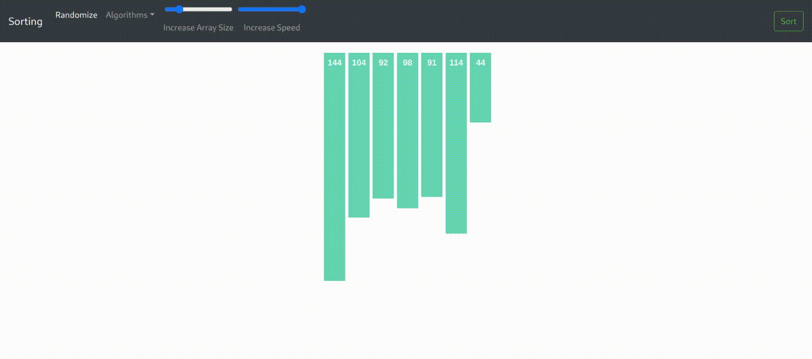
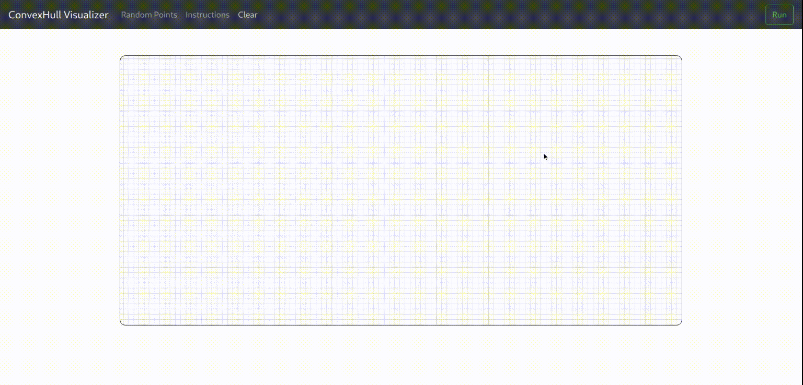

# Pathfinding-Visualizer2.0

<a href="https://algorithm-visualizer.vercel.app/">
    
</a>
<br/><br/>
<br/><br/>

Explore the **Pathfinding Visualizer** — a dynamic tool that showcases how various algorithms navigate a grid-based map to find the shortest path. Enjoy real-time animations and tweak settings to observe how different algorithms handle obstacles and paths.

 [](https://github.com/asmarubiya/Pathfinding-Visualizer2.0/blob/main/LICENSE)

## Algorithms

- **Sorting**

  - Selection Sort
  - Merge Sort
  - Quick Sort
    <br/><br/>
    

- **Pathfinding**

  - Dijkstra's Algorithm
    <br/><br/>
    

- **ConvexHull**
  - Graham's Scan
    <br/><br/>
    


## Installation

1. **Install Node.js**

   - Download and install [Node.js](https://nodejs.org/) (which includes npm) if you haven't already.

2. **Clone the Repository**

   - Clone this repository to your local machine using the following command:
     ```bash
     git clone https://github.com/asmarubiya/Pathfinding-Visualizer2.0.git
     ```

3. **Navigate to the Project Directory**

   - Change directory to the cloned project folder:
     ```bash
     cd Pathfinding-Visualizer2.0
     ```

4. **Install Dependencies**

   - Install all required packages by running:
     ```bash
     npm install
     ```

5. **Start the Application**

   - Launch the application with:
     ```bash
     npm start
     ```

6. **Access the Application**
   - Open your browser and go to [http://localhost:3000](http://localhost:3000) to view the application.

<p align="center">
Show some ❤️ and ⭐️ the repository to support the project!
</p>
